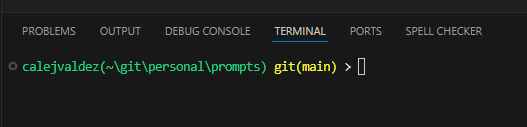
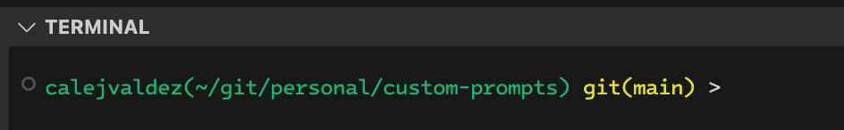

# Custom Prompts for PowerShell and Zsh

## Description

The files in this repository sets a custom prompt on your terminal to show:

- Your username
- Your location in the filesystem
- Which Git branch you're in, if any

These prompts are for
[PowerShell](https://learn.microsoft.com/en-us/powershell/) and
[Zsh](https://www.zsh.org/).

## Visuals

### Custom Prompt on PowerShell (Windows)



### Custom Prompt on Zsh (macOS/Linux)



## Installation

Please make sure you have [Git](https://git-scm.org/) installed.

### Windows

> [!IMPORTANT]
> Windows users must to enable script execution:
>
> ```powershell
> Set-ExecutionPolicy -ExecutionPolicy RemoteSigned -Scope CurrentUser
> ```

Append the contents of `powershell_prompt.ps1` to your `$profile`:

```pwsh
New-Item -Path $profile -ItemType "file" -Force
$text = Invoke-WebRequest -Uri https://raw.githubusercontent.com/calejvaldez/custom-prompts/refs/heads/main/powershell_prompt.ps1 -UseBasicParsing | Select-Object -ExpandProperty Content
Add-Content -Path $profile -Value $text
```

### macOS/Linux

> [!IMPORTANT]
> Linux users will have to install Zsh and change their shell:
>
> ```shell
> chsh -s $(which zsh)
> ```

Append the contents of `zsh_prompt.zsh` to your `.zshrc`:

```shell
touch ~/.zshrc
curl https://raw.githubusercontent.com/calejvaldez/custom-prompts/refs/heads/main/zsh_prompt.zsh >> ~/.zshrc
```
